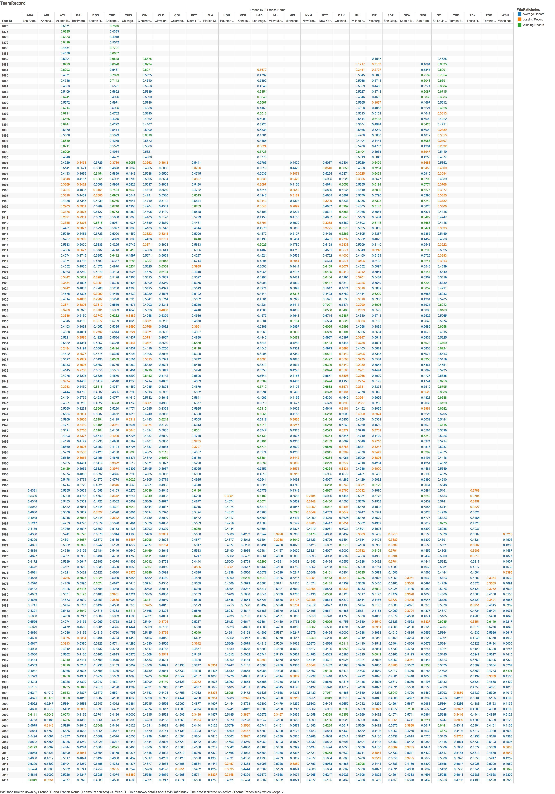

----
Final Project
Baseball Statistics
[Fall 2015] DataVisualizations, Cannata
12/7/15
----

Brian Bargas, German Martinez, Chris Pena


####Data:
Our Data was obtained from the Sean Lahman Online Baseball Database. It contains complete batting and pitching statistics from 1871 to 2014, plus fielding statistics, standings, team stats, managerial records, post-season data, and more. Specifically we took the master, hall of fame, and xxx cvs. 

Once we had this csv chosen we reformatted them using the ETL.R scripts then imported them into our oracle database.

The csv we used were;
Batting
Hall of Fame
Master
Salary
Team
TeamFrancise

```{r}
source("~/Documents/Academic/CompSci/Data/FinalProject/DV_FinalProject/00 Doc/filesummary.R", echo = TRUE)
```

####Visualization:


This scatterplot was created to compare the number of ballots with the number of votes per year. The number of ballots are the number people who voted for the Hall of Fame during that specific year and the number of votes are the number of votes that a person has gained to be considered for the Hall of Fame. The green squares are the ballots for that specific year and the blue circles are specific people that have gained a certain number of votes. Also the color of the green squares are homeruns where the lighter the color the less number of homeruns and the darker the color the more number of homeruns. Furthermore, the color of the blue circles are the number of hits where the lighter the color the less number of hits the person had and the darker the color the more number of hits the person had. The reason that this visual is important is because it shows a positive correlation for both scatterplots and the color of the points get darker as the years go by which means that more people are voting for the Hall of Fame every year and players get more hits and homeruns than the year before. Finally, this shows that as the players get more hits and homeruns then more people are likely to vote for Hall of Fame. 


Bar Chart 1: This barchart was created to look at the homerun average per hit of each team that was at bat at least 150k times. The bars were colored using a key performance indicator showing that any team who hit homeruns 10% or greater when getting a hit are blue while 5% to 10% are green and anything percent lower is orange. This shows that any team who were at bat higher than the average number of times at bat (386k) are only between 5% and 10% likely of getting a homerun when getting a hit. Furthermore, most of those below the average are either 10% and higher or less than 5% which is interesting how teams who had similar number of times at bat have a huge difference in number of homeruns. 


Scatterplot 2: This scatterplot was created to compare the number of votes needed to be selected for the Hall of Fame with the number of games played per year. These two scatterplots show a positive correlation which is interesting because it introduces the possibiltly that as the number of games played over the years increase then the number of votes needed to be selected for the Hall of Fame also increase.


This visualization depicts the batting averages for each active team from 1950-2014 via boxplot.
Each page details the average, median, upper and lower quartiles, as well as the outliars of each team's batting average.
This plot is interesting because it tells whether these values remained the same or fluctuated for each team as time passed by.
For further analysis, this plot could be blended with the Teams csv in order to determine if the batting average for each team could be related to that team's winning record (wins/games played).


Salary:
In the csv for franchise we have a dataset of how much each franchise manages to spend on salary. This visualization was created to be able to compare how much of a correlation there is between salary spent and a teams winning ratio, a calculated field created from dividing the number of wins by total games. From this bar chart we can see that there is a strong correlation between them, which could mean several things. A casual relationship where the more money spent on a team the more likely they are t win, an effect relationship which means that because they win so much they therefore have the money to spend on salary. Or neither which would mean that both of them are being caused by a third unknown factor. But one thing is for certain is that they are both related.


Hall of Fame Geographic:
In this visualization we obtained every baseball hall of famer and marked down they’re hometown on the map. Once there we color coded them by the persons category (ie. player, umpire, manager, etc). In the detail sheet we added the year they were added along with the name of the person. Something that can be observed about this graph is that it is very easy to see which areas of the United States have more often than not been prone to creating a baseball hall of Famer. One of the most notable observations is that the New England states have a much higher density in Baseball hall of famers than any other region, particularly the Midwest with little to now baseball legends.



Using the data from the franchise csv we are able to create a crosstab comparing the franchises over the course of several years with their winning ration, the calculated field mentioned earlier. Blending the franchise and team csv did this. In the scatter plot we are able to see whether a team had a winning record (>0.6) or a losing record (<0.4), color-coding it for ease of visibility. An observation we can make is many teams often got into streaks for several years. Either winning streaks or losing streaks would keep going, however this trend diminished by a big amount once more teams started being added to the league. One could say with increased competition the sport became harder to get on a certain type of streak.


####Shiny:
####Shiny App:  Our Shiny App can be found here : https://bswass.shinyapps.io/04Shiny


